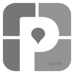
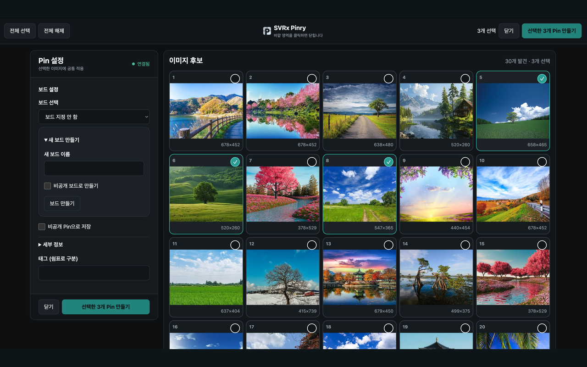

  

  
  

# SVRx Pinry

SVRx Pinry는 현재 페이지에서 이미지를 골라 사용자가 설정한 SVRx Pinry 서버에 Pin으로 저장하는 브라우저 확장입니다.

## 화면 미리보기

## 공식 지원 환경

- Google Chrome 121 이상
- Chromium 기반 Microsoft Edge

## 설치

스토어에서 바로 설치할 수 있습니다.

- [Chrome 웹 스토어에서 설치](https://chromewebstore.google.com/detail/svrx-pinry/kgncmldoobdakadnojepmalpbmacoonh?authuser=0&hl=ko)
- [Microsoft Edge Add-ons에서 설치](https://microsoftedge.microsoft.com/addons/detail/svrx-pinry/gmbgeiddpdblpjdbceoofclpeiikobjj)

### 수동 설치

1. GitHub 릴리스 ZIP 또는 저장소의 소스 ZIP을 내려받습니다.
2. ZIP 파일의 압축을 풉니다.
3. Chrome 또는 Edge의 확장 관리 페이지에서 개발자 모드를 켭니다.
4. **압축해제된 확장 프로그램을 로드합니다**를 선택합니다. 릴리스 ZIP은 압축을 푼 폴더를, 저장소의 소스 ZIP은 그 안의 `svrx-pinry` 폴더를 선택합니다.

## 서버 연결과 Pin 만들기

확장 옵션에서 SVRx Pinry **서버 주소**와 **API 토큰**을 입력해 저장합니다. 현재 페이지에서 확장을 실행한 뒤 이미지 후보를 선택하고, 기존 보드를 지정하거나 새 보드를 만든 다음 Pin 생성을 완료합니다.

## Firefox 안내

Firefox는 지원하지 않습니다. 공식 지원·배포·검증 대상은 Chrome·Edge로 한정합니다.

## 라이선스와 출처

라이선스는 `LICENSE` 파일에서 확인할 수 있습니다. upstream 프로젝트와 기여 고지는 `UPSTREAM.md`에 안내합니다.
